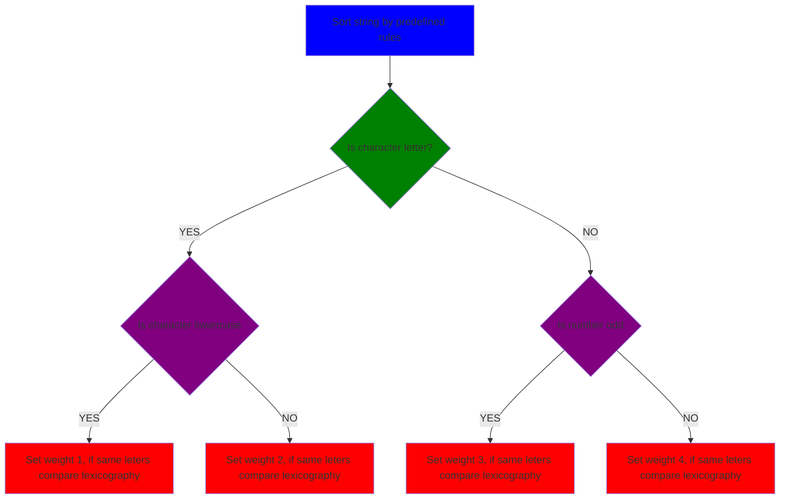

```mermaid
    flowchart TD;
    
    SORT_STRING_BY_RULES["Sort string by predefined rules"]
    style SORT_STRING_BY_RULES fill:blue

    IS_CHAR_LETTER{Is character letter?}
    style IS_CHAR_LETTER fill:green

    IS_CHAR_LOWER{"Is character lowercase"}
    style IS_CHAR_LOWER fill:purple

    IS_CHAR_DIGIT{"Is number odd"}
    style IS_CHAR_DIGIT fill:purple

    LOWER_CASE_ACTION["Set weight 1, if same leters compare lexicography"]
    style LOWER_CASE_ACTION fill:red
    
    UPPER_CASE_ACTION["Set weight 2, if same leters compare lexicography"]
    style UPPER_CASE_ACTION fill:red

    ODD_NUMBER_ACTION["Set weight 3, if same leters compare lexicography"]
    style ODD_NUMBER_ACTION fill:red

    EVEN_NUMBER_ACTION["Set weight 4, if same leters compare lexicography"]
    style EVEN_NUMBER_ACTION fill:red


    SORT_STRING_BY_RULES --> IS_CHAR_LETTER

    IS_CHAR_LETTER -- YES -->IS_CHAR_LOWER
    IS_CHAR_LETTER -- NO -->IS_CHAR_DIGIT

    IS_CHAR_LOWER -- YES --> LOWER_CASE_ACTION
    IS_CHAR_LOWER -- NO --> UPPER_CASE_ACTION

    IS_CHAR_DIGIT -- YES --> ODD_NUMBER_ACTION
    IS_CHAR_DIGIT -- NO --> EVEN_NUMBER_ACTION

```