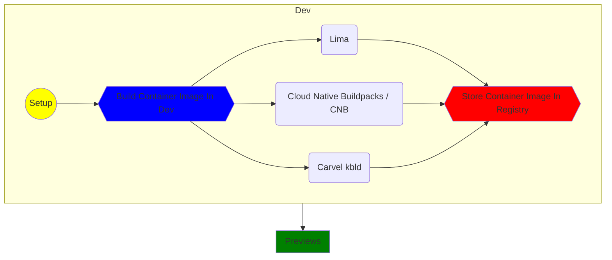

```mermaid

flowchart TD;
    subgraph Dev
        setup_dev((Setup))
        style setup_dev fill:yellow    
            
        bci{{Build Container Image In Dev}}
        style bci fill:blue

        bci_Lima(Lima)
        bci_buildpacks(Cloud Native Buildpacks / CNB)
        bci_kbld(Carvel kbld)
        registry{{Store Container Image In Registry}}
        
        
        setup_dev --> bci
        bci --> bci_Lima --> registry
        bci --> bci_buildpacks --> registry
        bci --> bci_kbld --> registry
        style registry fill:red
    end

    subgraph Previews
    style Previews fill:green
    end

    Dev --> Previews


```